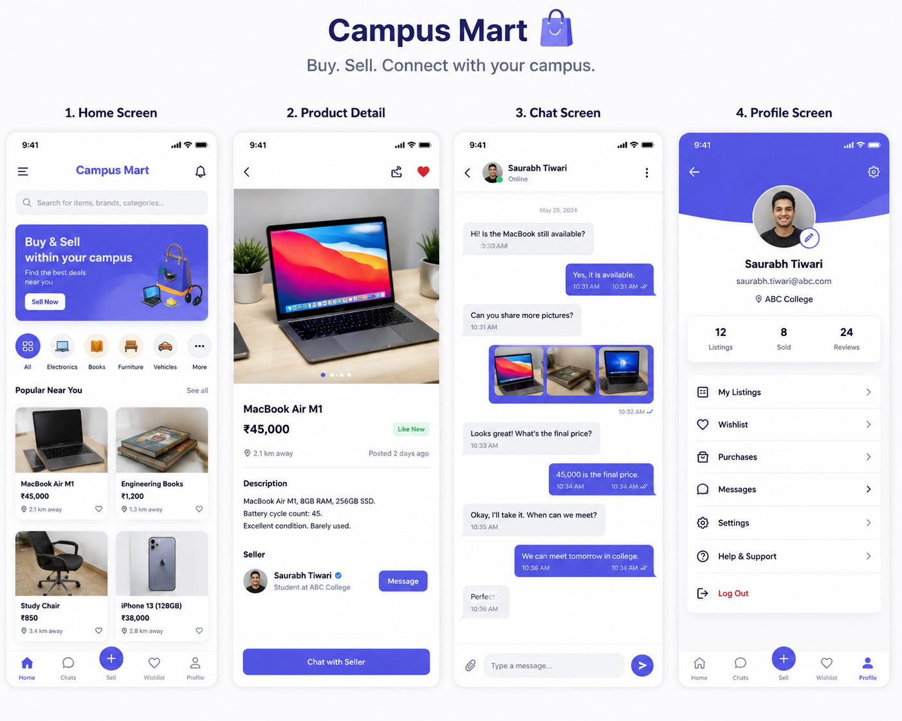

# Campus Mart 🚀

Campus Mart is a campus marketplace application inspired by OLX where students can buy and sell products within their college community.

## ✨ Features
- User Authentication
- Product Listings
- Product Search
- Wishlist
- Real-time Chat System
- User Profiles
- Responsive UI

## 🛠 Tech Stack
- Flutter
- Firebase
- Supabase
- Dart

## 📱 Screenshots



## 🚀 Installation

```bash
git clone https://github.com/deadshotsaurab/campus-mart.git
cd campus-mart
flutter pub get
flutter run
